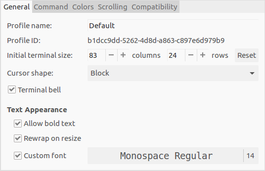
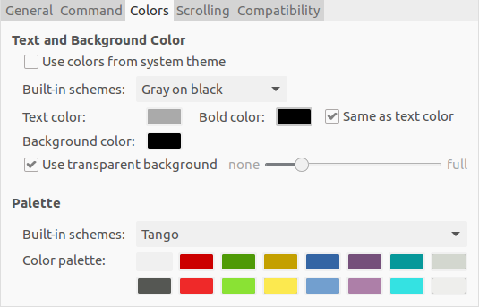

## Softwares

Vim, Sublime Text, Typora, Chrome, GoldenDict, B1 Free Archiver, CuteCom, f.lux, Foxit Reader, Sougou pinyin, Meld, Netease Music, VM Box, PlayOnLinux, Unity Tweak Tools, VSCode, VNC Viewer, WPS

ShadowsocksR

## Terminal Tools

tmux, aptitude, minicom, cmake, c++11, aria2, git, zsh, autojump, tofrodos

## Terminal Settings

## Theme

[Use Flatabulous](https://www.jianshu.com/p/463f229c0a20)

## 一键部署脚本

put the fonts you want to the directory `fonts`, then rerun the fonts part in the `gui_softwares.sh`.